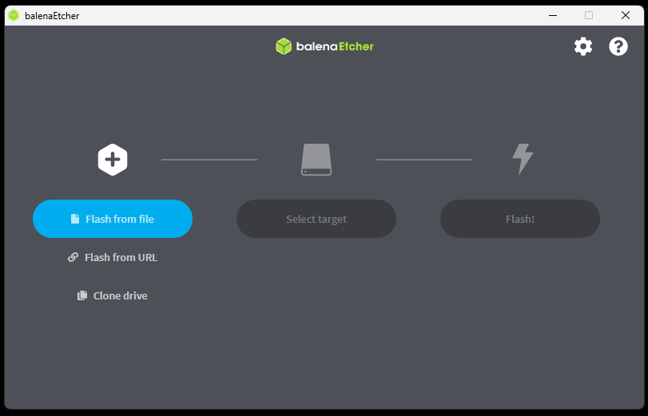
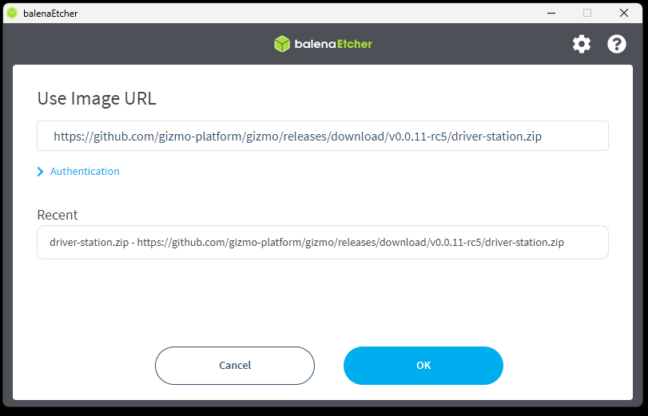
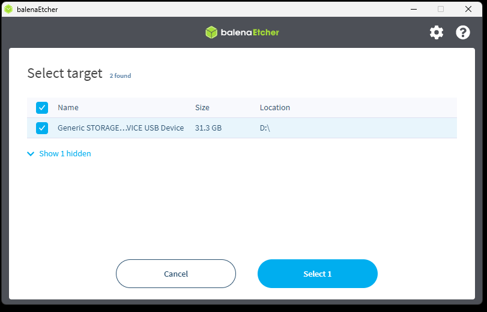
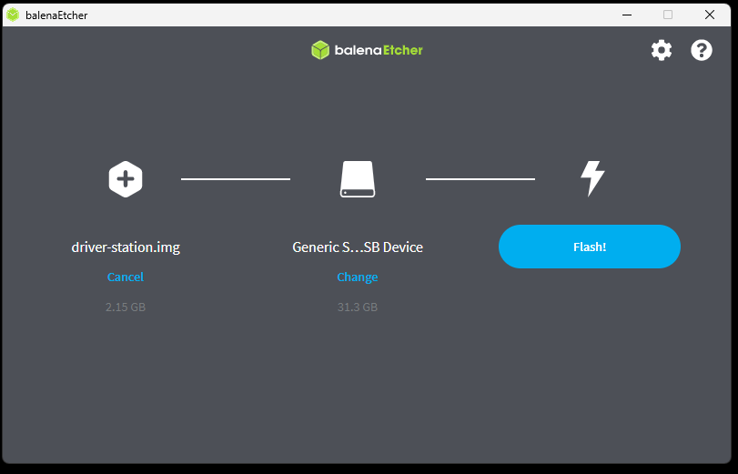
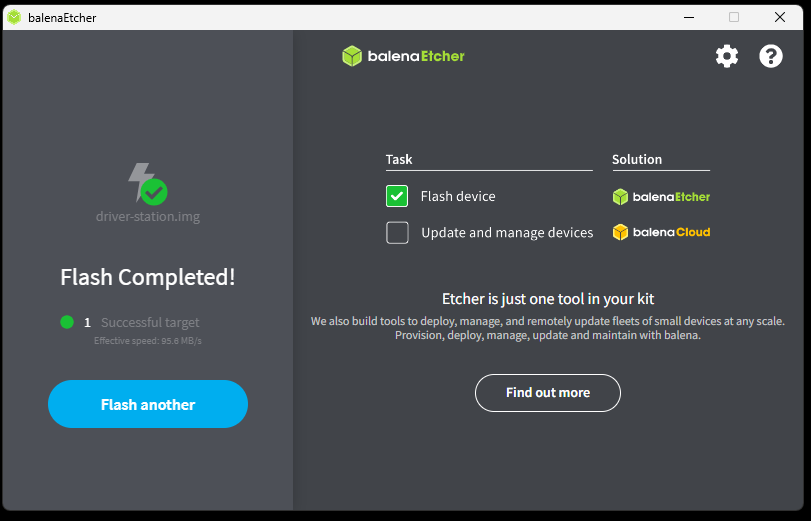

# Writing Images

Configuring some parts of the Gizmo ecosystem involve writing entire
disk images all at once.  This requires tooling that can deal with
these image files, and this page details information on the options
available and how to use Balena Etcher, a good choice for beginners.

To write an image to an SD card, you have a few choices.  If you're on
a mac or a Linux machine, you can use `dd`.  On Windows you can use
[Win32DiskImager](https://win32diskimager.org/).  If you've never
written disk images before, the Gizmo team recommends you use [Balena
Etcher](https://etcher.balena.io/) which is available for all
platforms, and guides you through the process.

> [!TIP]
>
> Balena Etcher Portable edition can be used without needing to
> install.  This can be convenient to not clutter your machine with
> extraneous programs, or to write files from a machine where you do
> not have administrative permissions to install new programs.

Writing software images with Balena Etcher looks like this:

When you open the main application screen, it will look like this:

Either download and extract the required image file, or paste the URL
directly into the box on the "Use Image URL" screen:

Click the "Select target" button and connect your micro SD card.  The
disk will appear as a target that you can use.

> [!WARNING]
>
> Balena will automatically hide any volumes that it detects the
> system may be booted from, so generally you can't hurt your computer
> with this process.  Be extremely careful though to select the right
> disk if you show hidden devices.  A good way to make sure you've got
> the right disk is to confirm the size of the device, which should
> match closely to the size of your micro SD card.  The exact size may
> differ slightly due to the way in which device manufacturers market
> capacity.

Once configured, the Etcher window will look similar to this:

The flashing process will take several minutes.  On average with a
modern computer, the Gizmo team observes this process taking about 3
minutes.

> [!NOTE]
>
> You may be prompted to authorize the command prompt prior to the
> flash process commencing, this is a normal prompt as Balena Etcher
> needs to access low-level system utilities to write the data to the
> micro SD card.

Once complete, the Etcher window will look like this:

You may now close Etcher and remove the micro SD card.
