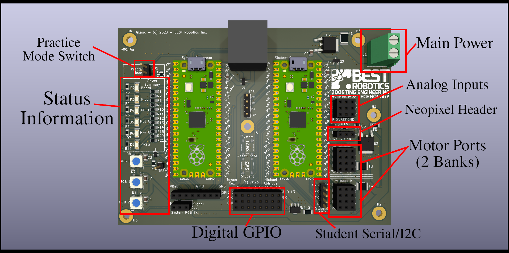

# Gizmo Library

In the last tutorial we used the Servo library to control a motor.
The Gizmo itself has a library that we referenced in the previous
tutorial, but didn't dive into it deeply.  Lets do that now and learn
about what functions the Gizmo library includes.

## Named Constants

The Gizmo library provides special names for a number of different
items to make referring to them more intuitive and clearer.  This
isn't an excuse to not document your code, however, and you should
still take time to produce thoughtful comments to help others and your
future self understand what your program does!

The named constants that the `<Gizmo.h>` library provides can broadly
be subdivided into 2 categories: items related to the gamepad, and
items related to the Gizmo board itself.

### Gamepad Values

On the recommended Logitech F130 gamepad, there are 2 joysticks, 1 POV
hat, 2 triggers, 2 shoulder buttons, 4 thumb buttons, and 2 special
buttons in the center area of the controller.  If you push down on the
joysticks themselves, you'll hear and feel a satisfying click because
the joysticks are buttons too!

The gamepad has the following named axes.  Axes values range from 0 to
255, with the neutral position at 127.  The joysticks have a deadband,
sometimes called a "detent" around this value to ensure that even with
small manufacturing differences between gamepads when you let go of
the joysticks they self-center and return to the 127 value.

  * `GIZMO_AXIS_LX` - Left stick X-Axis
  * `GIZMO_AXIS_LY` - Left stick Y-Axis
  * `GIZMO_AXIS_RX` - Right stick X-Axis
  * `GIZMO_AXIS_RY` - Right stick Y-Axis
  * `GIZMO_AXIS_DX` - D-pad/POV hat X-Axis.  This will "snap" between
    0 and 255.
  * `GIZMO_AXIS_DY` - D-pad/POV hat Y-Axis.  This will "snap" between
    0 and 255.

Similarly, all of the buttons are named as well:

  * `GIZMO_BUTTON_X` - X button
  * `GIZMO_BUTTON_A` - A button
  * `GIZMO_BUTTON_B` - B button
  * `GIZMO_BUTTON_Y` - Y button
  * `GIZMO_BUTTON_LSHOULDER` - Left shoulder button
  * `GIZMO_BUTTON_RSHOULDER` - Right shoulder button
  * `GIZMO_BUTTON_LT` - Left trigger
  * `GIZMO_BUTTON_RT` - Right trigger
  * `GIZMO_BUTTON_BACK` - Center back button
  * `GIZMO_BUTTON_START` - Center start button
  * `GIZMO_BUTTON_LEFTSTICK` - Left joystick stalk
  * `GIZMO_BUTTON_RIGHTSTICK` - Right joystick stalk

### Gizmo Port Values

The Gizmo has a number of I/O interfaces for your use.  These are
divided up into names based on functions.  The names correspond to the
names on the diagram below:



For motors, there are port names `GIZMO_MOTOR_N` where `N` is a number
ranging from 1-8.  On newer boards with dedicated servo ports, `N`
ranges from 1-4 with an additional set of names `GIZMO_SERVO_N` to
identify servo ports 1-4.

For digital I/O, the GPIO ports are numbered from 1-8, and can be
referred to as `GIZMO_GPIO_N` where `N` is the port number you wish to
address.

The Gizmo contains 3 analog to digital converters, that allow you to
sense an analog value such as one that varies based on a potentiometer
reading.  These ports are identified as `GIZMO_ADC_N` where `N` is
between 1-3.

> [!WARNING]
>
> The analog ports must not be connected directly to the battery as
> doing so would harm the voltage measuring circuitry.  Use only the
> power provided on the ADC port as the voltage reference!

For serial functions, the UART port is named with two special names
for the TX and RX pins.  These names are `GIZMO_UART_TX` and
`GIZMO_UART_RX`.
[UART](https://en.wikipedia.org/wiki/Universal_asynchronous_receiver-transmitter)
is a somewhat antiquated term to refer generally to a serial port.
When looking at the above image, the pin order is top to bottom,
ground, TX, RX, 3.3v.

Finally, the neopixel header where you can connect programmable LEDs
is identified by the symbol `GIZMO_NEOPIXEL`.


## Functions

The `<Gizmo.h>` library provides more than just names for pins.  It
provides a convenient way to interact with the field control server
running on a driver station or full field management system.  Using
this functionality is very similar to using the Servo library.  First
we tell the compiler that we want to make use of the library in our
program:

```C
#include <Gizmo.h>
```

Then, at the top of the program outside the `setup()` and `loop()`
functions we create a named instance of the library to use.  For
convenience, we'll call it `gizmo` in these docs, but you are free to
name it any valid C symbol name.

```C
Gizmo gizmo;
```

Then, in the `setup()` function, we can run the `begin()` funcion of
the library to connect to the System Processor.

```C
setup() {
    gizmo.begin();
}
```

Each time through the `loop()` function we need to refresh the data
from the System Processor so that we can use any values that have
changed.  This is done by calling the `refresh()` method.

```C
gizmo.refresh();
```

Finally, we can use the `getButton(id)` and `getAxis(id)` methods to
retrieve the values of buttons and axes, respectively.  The `id`
parameter expected by these functions is one of the named constants
described earlier

The button values are returned as boolean values of either `true` or
`false` and can be used in conditional statements or other control
structures.  The axis information is returned as an unsigned 8-bit
number (byte) ranging from 0-255, with the neutral position at 127.

## Recap

We learned that the Gizmo library provides names for pins on the
physical board as well as names for the various buttons and axes on
the gamepad.  We then learned that there are functions for accessing
this information.
