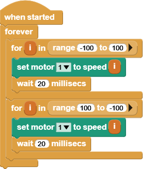

# Spin a Wheel

Let's explore more of the blocks in the Gizmo block library. In this
tutorial, we'll cover how to control motors with the Gizmo. For this,
we'll make use of a
[VEX MC-29 motor controller](https://www.vexrobotics.com/276-2193.html).
These motor controllers use a
[Pulse Width Modulation (PWM)](https://en.wikipedia.org/wiki/Pulse-width_modulation)
signal to determine direction and magnitude of the motor rotation they
control.

## The Gizmo Motor and Servo Blocks

The Gizmo block library handles all of the PWM details for you with two
command blocks: Set Servo To Position and Set Motor To Speed. Each of
these blocks has a drop down menu to pick the Gizmo port and a number
input for the position or speed.

The motor block accepts speeds from -100 to 100.

The servo block accepts positions from -90 to 90.

## Sweeping Motor Speeds

This example program runs a motor on Gizmo's motor port 1 through the full
range of its speeds.

This program begins with a When Started hat block that will run the stack
when the program starts running. Underneath that, we have a Forever loop
to keep our program running the whole time the Gizmo is powered on.

Within the Forever loop, there are two For loop blocks. This block repeats
the stack of blocks within it a specific number of times. It does this by
tracking a loop variable, which is named "i" by default. Each time the
loop repeats, the loop variable will increase by 1. The input value of
the loop block sets the value on which the loop will stop.

> [!NOTE]
> 
> Unlike most text-based programming languages, MicroBlocks for loops
> start counting at 1. So, a loop block with end value set to 10 will
> count 1 through 10 inclusive.

In our case, we've replaced the stopping number with a Range block. This
block changes the behavior of the For loop block. With the Range block, we
can change the starting point of our for loop. In our example program, we
loop through numbers from -100 to 100 in our first For loop, driving the
motor from full reverse to full forward. In the second For loop, our range
is set up to count in the opposite direction.

The black arrow on the right side of the Range block is a button that will
expand the block to show optional inputs. For the Range block, the
optional input controls the step size of the loop. For example, if we
wanted to count even numbers from 2 to 10, we would want to add 2 to the
loop variable for each loop.

In each For loop, we have a Set Motor To Speed block and a Wait
Milliseconds block. The motor block will set our motor speed to the value
of the loop variable. To use a loop variable as input to another block,
you can drag the orange loop variable block from the loop to the block
where you want to use it. The wait block is there to give our motor time
to react to the new control signal.

To see this program in action, attach a motor to your Gizmo's first motor
port using a Vex MC-29 motor controller and run the program. The motor
should speed up and slow down over and over, changing directions each time.

> [!NOTE]
>
> Motors take a lot of power.  Way more than can be safely pulled out
> of the USB ports on your computer.  To run this program, you'll need
> to have a battery conected to your Gizmo board.  Check the
> instructions around the [Main Power
> Connector](/startup/index.md#main-power-connector) for more
> information on connecting this cable.

## Recap

In this tutorial, we learned how to control a motor with the Gizmo block
library. We also learned how to use For loop blocks and Range blocks to
iterate over a range of numbers. We're just a few steps away from writing
code to control our robot with a gamepad, in the next tutorial.
