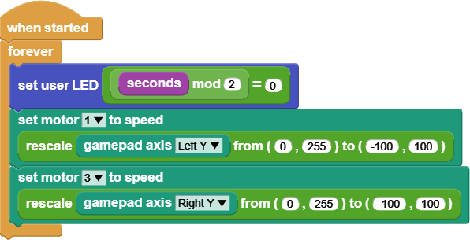

# Drive a Robot

In this tutorial, we'll walk through a program which drives a basic robot.
The robot this code can control has two motors. Each motor is connected to
a wheel on either side of the robot. Our goal is for our program to
control each motor with one of the gamepad's joysticks. The left motor
should be attached to motor port 1. The right motor should be attached to
motor port 3.

> [!NOTE]
> To run this program, you will need the Gizmo to be connected to your
> driver station. You will need to connect your Gizmo to a battery and
> turn both the Gizmo and the driver station on.

The two control blocks in this program are the When Started and Forever
blocks we've seen multiple times in these tutorials. Hopefully, you're
familiar now with this pattern to start our program when the Gizmo turns
on and keep it running until our Gizmo turns off.

The first thing our program does in the loop is blink the built in LED.
This is a useful thing to do in your robot programs so you can tell if
your code is still running or has frozen because of some bug in your code.
The last time we blinked an LED, we used the Wait Milliseconds block to
keep the LED on and off for some time. In this case, we don't want our
joystick controls delayed just so our LED can blink. Instead, we'll use
the Seconds block and some operators.

The Seconds block is a reporter block that tells our program how many
seconds have passed since our program started running. Combining the mod
and equality operator blocks lets us check if a number is even. It will
return true when the number is even and false otherwise. By turning on the
LED when seconds is even and off when seconds is odd, our program blinks
the LED slowly enough for us to see.

The next two blocks in our loop stack are motor blocks. In this case, we
are setting the motor speed using the position of the left and right
vertical joystick axes. The joysticks give us their position on a scale of
0 to 255, but our motors take speeds in the range -100 to 100. To
translate from the joystick range to the motor range, we use the Rescale
block.

The Rescale block has five input fields. The first is the value that will
be scaled. In our program, we've filled this input with the Gamepad Axis
block. The second and third inputs of the Rescale block tell the block
about the input value's range. The fourth and fifth inputs define the
output range.

The Rescale block is considered an advanced block in MicroBlocks. In order
to find it, you need to go into the settings menu and click "show advanced
blocks." After that, it should show up in the Operators category of the
block palette.

So, using the Rescale blocks in our program, a joystick value of 0 is
transformed into a motor speed of -100. A joystick value of 255 becomes a
motor speed of 100. Any joystick position between those is mapped to the
corresponding number in the output range.

## Recap

In this tutorial, we built a program to drive a basic robot. You can use
this program as a starting point for your robot's code.

If you would like an example program that includes more motors and servos,
check out the BEST default program. You can find this by clicking "open"
in the file menu and opening "BEST Robotics Default Program" from the
"Kits and Boards" category in the examples pop up.
