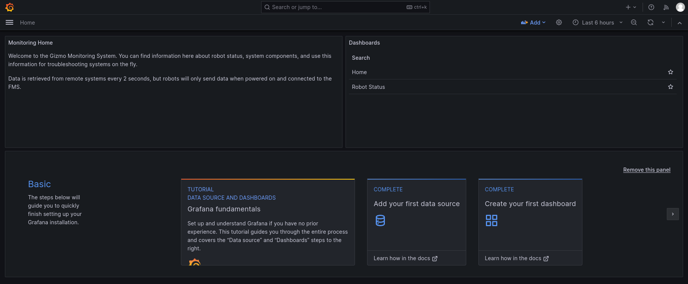
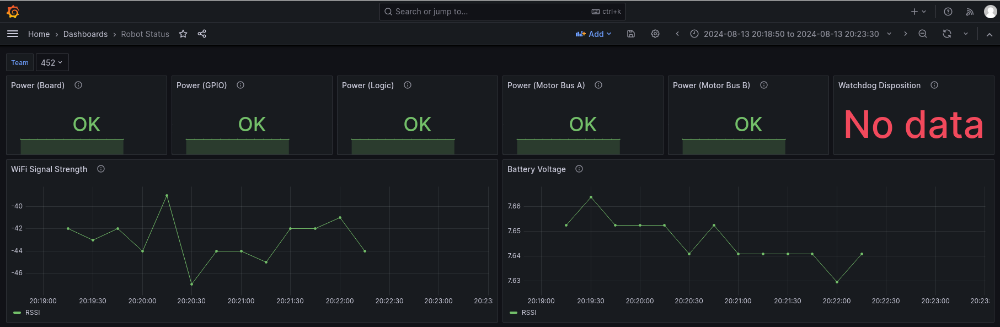

# Gizmo System Metrics

The FMS provides coordinates a lot of data cross various systems.
Part of the data that it coordinates includes metrics and diagnostic
information from every Gizmo actively connected to the FMS.  In
general terms, this means that every 2 seconds every Gizmo that is
part of an active match will be reported to the FMS and logged in a
Time Series Database (TSDB).  In practical terms, this means you can
explore historical data about how Gizmos perform during matches.

## Accessing Metrics

On the FMS Workstation or from a machine connected to the FMS network
(having an address in `100.64.0.0/24`), the metrics are available via
a Grafana instance running at <http://100.64.0.2:3000/>.

On first login, use the username `admin` and the password `admin`.
You will be prompted to change the password, pick a secure value as
the user you are changing the password for has an adminstrative role.

Upon changing the password, you'll be greeted with a landing page:

Click on the "Robot Status" item in the right column to access the
robot status dashboard.  The dashboard will look similar to this
example:

The dashboard provides information on a single robot at a time.  The
top row shows the status of the various power systems on the robot,
and the hardware watchdog if enabled.  The graphs in the second row
show the strength of the network connection and the battery voltage
being supplied to the Gizmo.

> [!NOTE]
>
> The Received Signal Strength Indicator (RSSI) value is presented
> using the standard dBm unit.  This means that numbers closer to zero
> are better (the value is presented as a negative number).

## What can you DO with the metrics?

The metrics presented allow you to answer questions about things like
if a signal drop out was due to low battery, if a Gizmo reported a
tripped polyfuse, or if the wireless network signal is degraded below
a point of usability.

> [!TIP]
>
> The metrics are stored in a Prometheus instance on the FMS.
> Prometheus and Grafana usage are far far beyond the scope of this
> manual, but these are industry standard technologies for metrics
> reporting and visualization.  You can create your own custom
> dashboards that show information in a way that makes sense to you!
