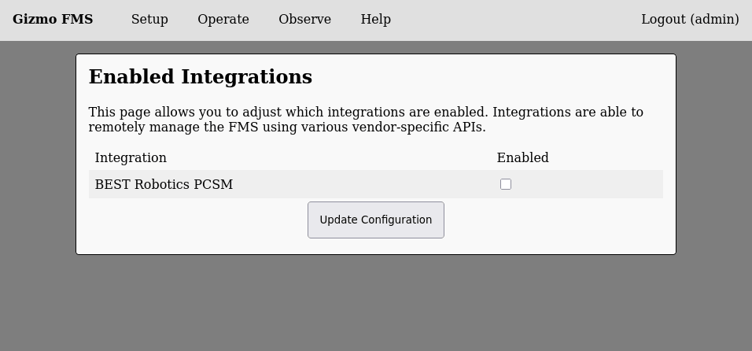
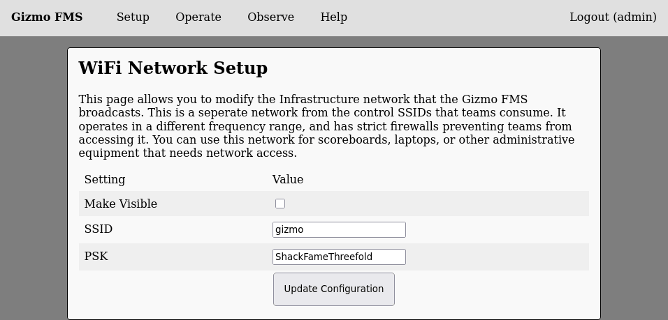

# Additional Settings

The only required settings that must be configured to use the FMS are
the team roster and field hardware IDs.  All other settings will
default to sane defaults, however you may wish to adjust these
settings based on your specific event.

## External Integrations

The FMS can be automatically driven by external integrations.  These
integrations may be configured from the 'Integrations' option in the
setup menu.  The page looks like this:

Check or uncheck the boxes next to integrations to enable or disable
them.  Ensure you save the configuration before navigating away from
this page.

## WiFi Network

The FMS hardware provides a so-called "Infrastructure Network" that
you can use as a general purpose wireless network to connect
additional computers, projectors, or other game infrastructure to.
This network is considered a trusted network, so teams should not have
access to it.  You may view or change the generated SSID and PSK by
selecting 'WiFi Settings' from the setup menu.

