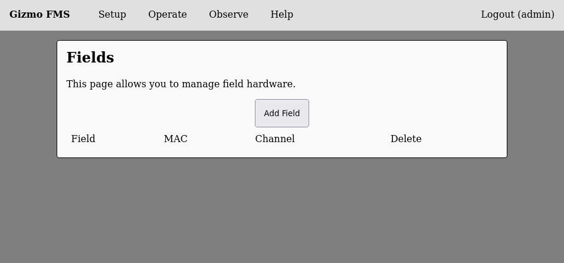
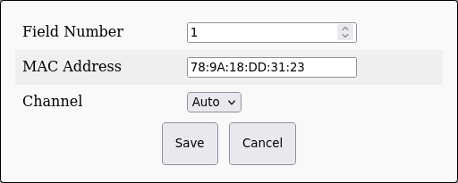
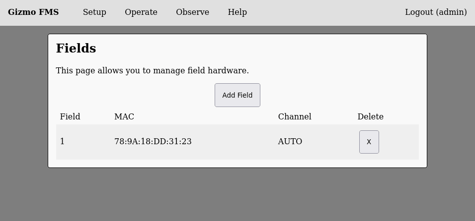

# Configure Fields

The FMS needs to be told what hardware goes with what field.  Most
events will only have a single field, but for larger events multiple
fields allow multiple parallel matches to be played.  When using
multiple fields, take care to label the hardware with its identity so
no mishaps occur with placing the wrong radio at the wrong field.

Begin by selecting 'Fields' from the setup menu, which will display
the main field listing:

Click on 'Add Field' to add your first field, and input the hardware
ID you saved during hardware setup:

You may specify the channel now, or change it later.  When you are
satisfied, click save and the field will be saved into the
configuration.

Continue to add as many fields as you will have at your event,
ensuring that you make note of what field ID you assign to each
physical device.

> [!WARNING]
>
> It is not supported to remove fields after the network has been
> bootstrapped.  Doing so will result in an FMS crash that is
> difficult to recover from, and likely will require assistance from
> the Gizmo developers.

After configuring fields, review any additional configuration as
required before proceeding to the network bootstrap.
