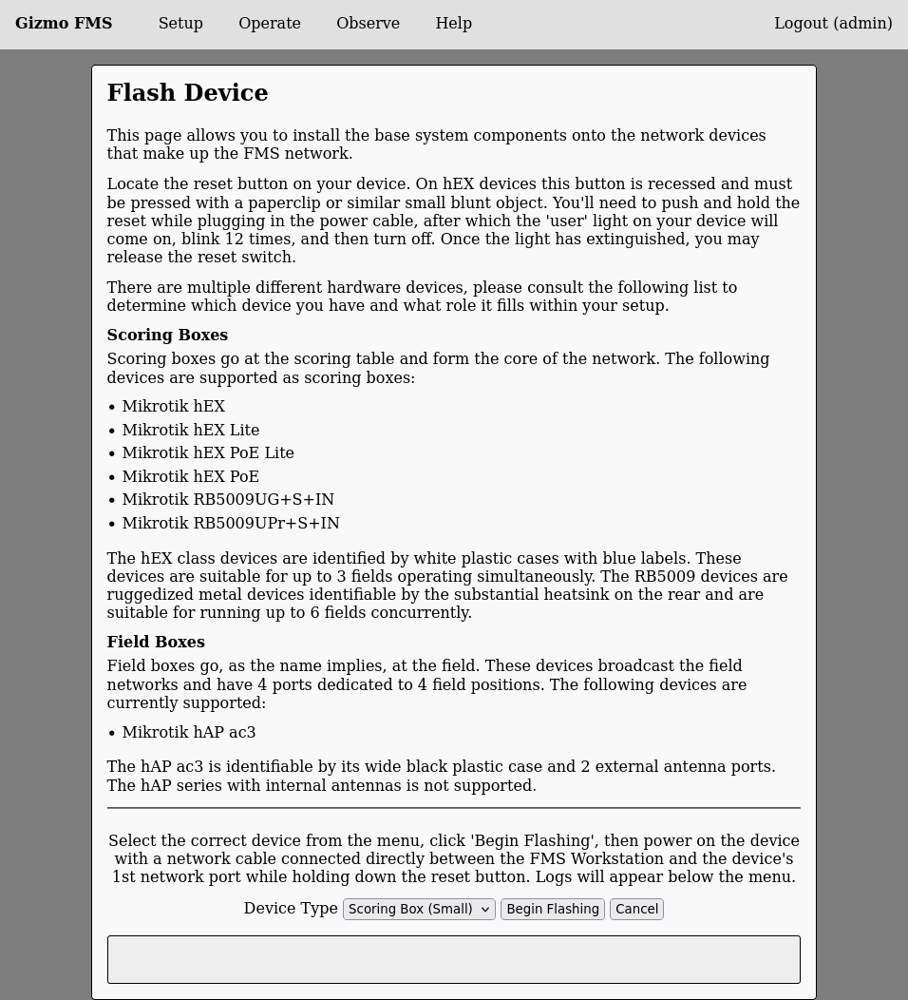
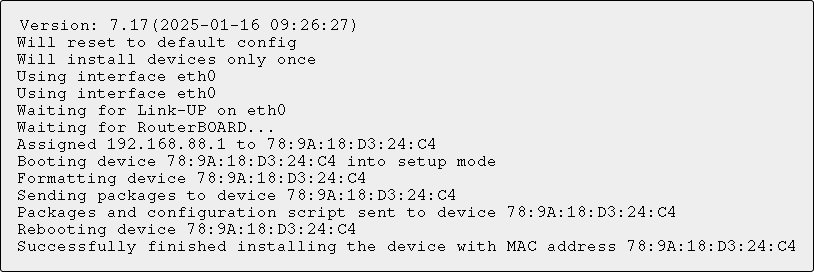

# Prepare Hardware

In the graphical workflow we prepare the hardware before configuring
fields, as the process of preparing the hardware will retrieve certain
identifiers that are used in configuration later.

Select 'Flash Device' from the setup menu, which will provide more
detailed information on the resulting page:

Once you select the device you will be flashing and press 'Begin
Flashing' text will appear in the gray box below the menu.  Connect an
Ethernet cable between the FMS Workstation and the 1st Ethernet port
on the powered off device.  Then connect the power to the device while
pushing and holding the device's reset button.  Release the button
when the text 'Booting device' appears in the logs window.

A successful installation will look like this:

Make note of the MAC address printed in the last line when flashing
your field boxes as you'll need this in the next step to setup your
fields.  Complete flashing of all devices before proceeding from this
step.
