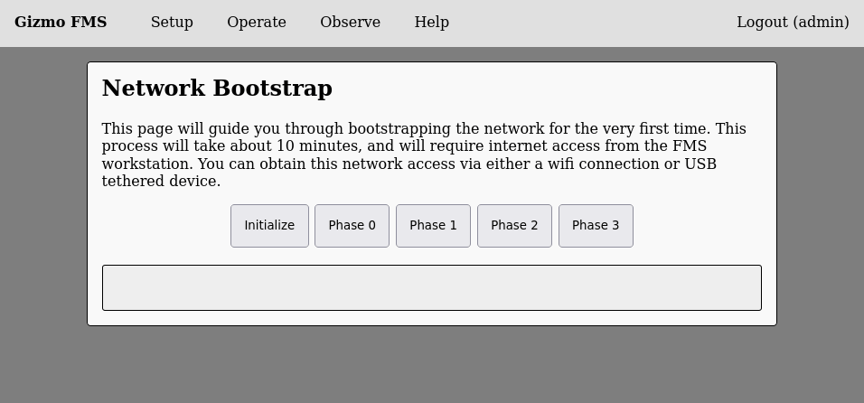
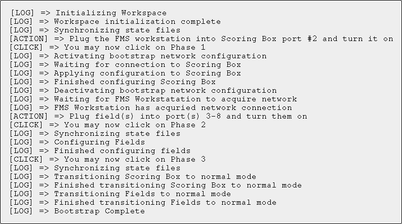

# Network Bootstrapping

The FMS makes use of a sophisticated programmable network architecture
which requires one-time bootstrapping per competition.  This bootstrap
procedure should take about 10 minutes.  You'll need the FMS
Workstation, the Scoring Box, and any Field Boxes.

Start with the network devices powered off and unplugged.  Connect an
Ethernet cable between the FMS Workstation and port 2 on the Scoring
Box.

Select 'Net Bootstrap' from the setup menu, and you will be greeted by
this interface:

Click on 'Initialize' followed by 'Phase 0'.  Follow the prompts
displayed in the gray box and when told to do so, power on the scoring
box.  Follow the prompts to complete network device flashing.  Once
complete, the gray box will look similar to this:

After finishing the bootstrap, reboot the FMS workstation by holding
the power button for 4 seconds until the device turns off, then press
the button again to boot the workstation again.
