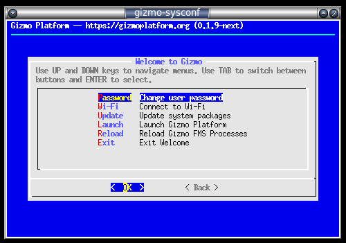
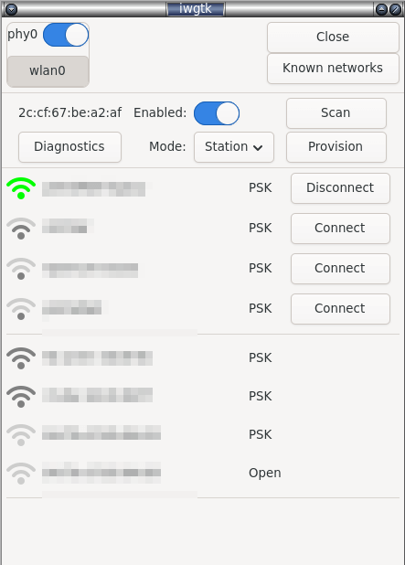
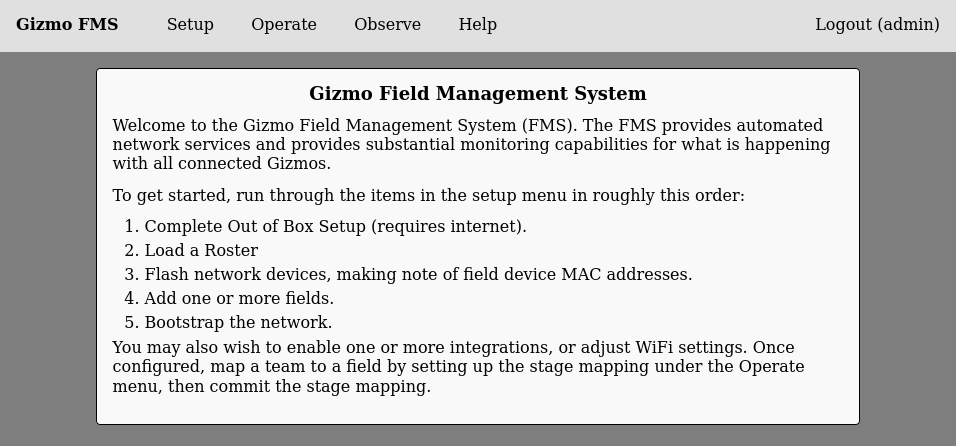
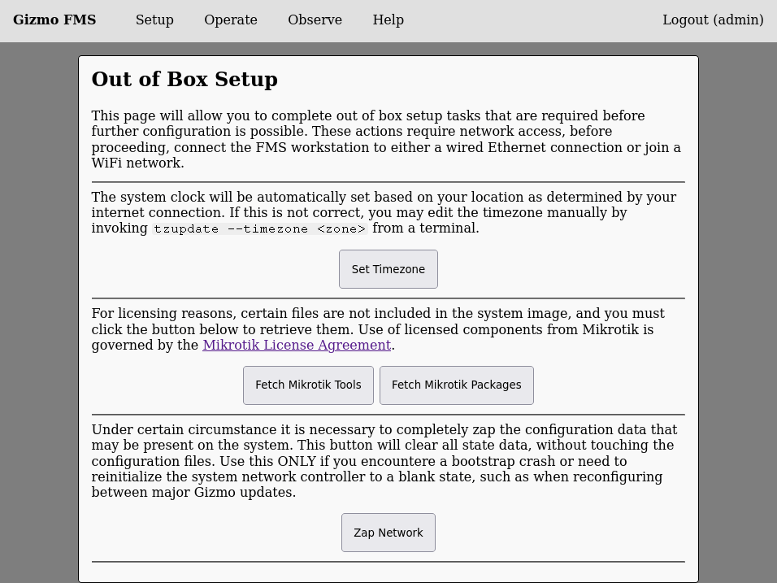

# Initial Tasks

Once the FMS system image is installed and you are greeted by the
desktop, there are a few tasks to complete prior to actually setting
up the FMS itself.  Briefly, you'll need to accomplish the following:

  * Connect the FMS Workstation to a Wi-Fi network.
  * Set the timezone and clock.
  * Download certain restricted artifacts that cannot be distributed with the system image.
  * Change the default password. (Optional, but highly recommended)

When the FMS is booted you will always be greeted by the System
Configuration screen.  This screen is blue and looks like this:

This screen can be navigated by using the arrow keys and return to
make a selection.  Start by changing the default password for the
admin user.  The password that is set by default is `gizmo`.

Next, select the option to connect to Wi-Fi, which will launch a new
window to select your network.  The Wi-Fi selection window looks like
this:

Select your network, click Connect, and input a password if prompted.
After a few moments, the strength indicator will change to show you
are connected, and you may dismiss the Wi-Fi screen by clicking on the
close button at the top right of the window.

You are now ready to launch the FMS Web Admin system, which will be
used to complete the rest of setup.  Do so now by selecting 'Launch
Gizmo Platform' from the menu, and wait for the firefox window to
appear.  The Gizmo landing page looks like this:

Select the option for Administration, and enter the username `admin`
and the password you selected above.  You'll be greeted by the
administrative landing page which looks like this:

Select "Out of Box" from the setup menu, which will return a page that
looks like this:

Click "Set Timezone" then wait several seconds for the action to
complete.  Next click on "Fetch Tools" and wait for the download to
complete.  Finally, click on "Fetch Packages" and wait for the series
of downloads to complete.  If you encounter an error, these actions
are safe to retry until the system succeeds.

