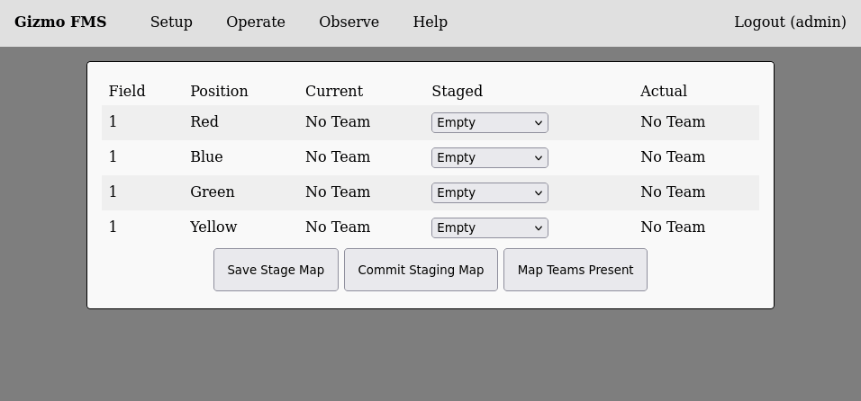
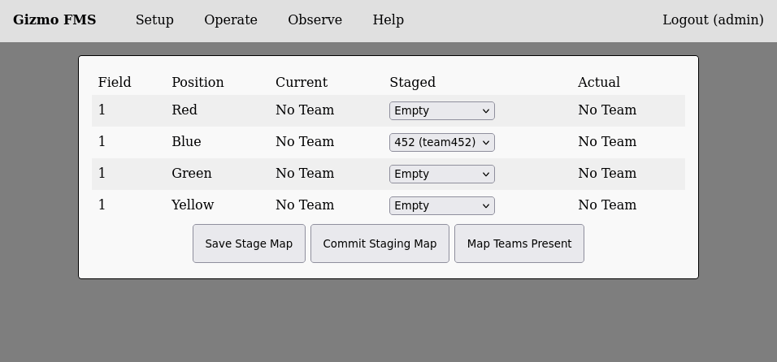
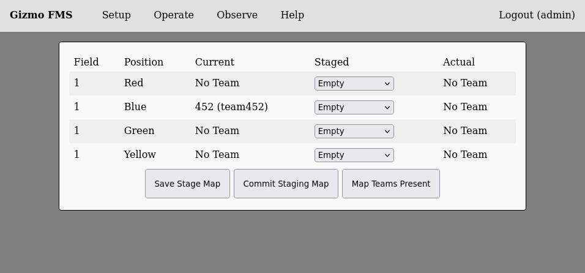

# Operating the FMS

The FMS can be operated in of two ways:

  * Fully Manual - Team mapping is managed by a human operator who
    keys in each match when its time to change the field setup.

  * Remote Managed - The FMS is called by a remote system which
    maintains the schedule and inserts matches as required.

## Manual Operation

To manually setup a match, select 'Stage Mapping' from the 'Operate'
menu.  The mapping interface looks like this:

Setting up a match is as easy as selecting the teams from the drop
downs for each field position, and then selecting to save the stage
mapping.  You can edit a stage mapping at any time without disrupting
an active match.  This is what the interface looks like with a mapping
staged:

When you are ready to make the stage mapping active, click on 'Commit
Staging Map' and all configured fields will cycle to the currently
staged set of teams.  This will take about 10 seconds, resulting in
the following view:

The right-most column of the table shows which teams are physically
present and connected to the field, with the location being shown as
the location of the Driver's Station.  This information is extremely
handy when coupled with the 'Map Teams Present' button.  This button
immediately updates the active mapping to match the real locations of
whatever teams are at the field at the moment it is clicked.  This
will disrupt any active communication, so do not click on it during a
match.  The active mapping feature is designed as a speed enhancement
for running practice or ad-hoc matches where there is not a set order
that teams will appear at a given field position.

