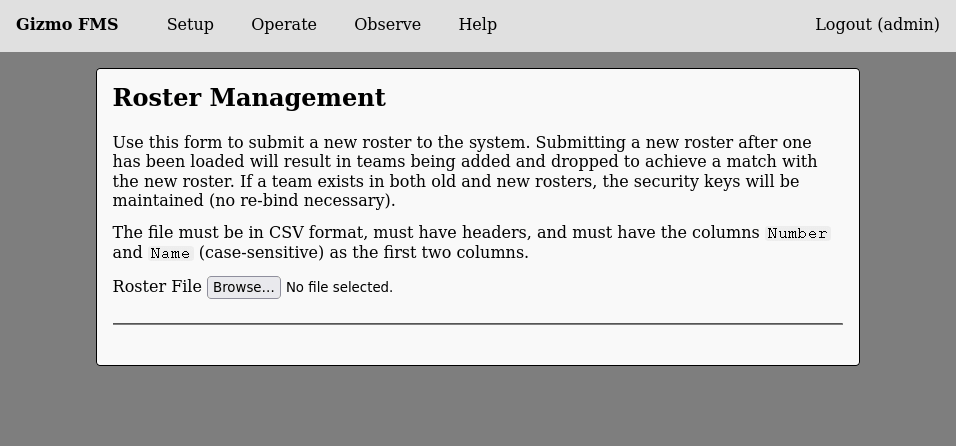
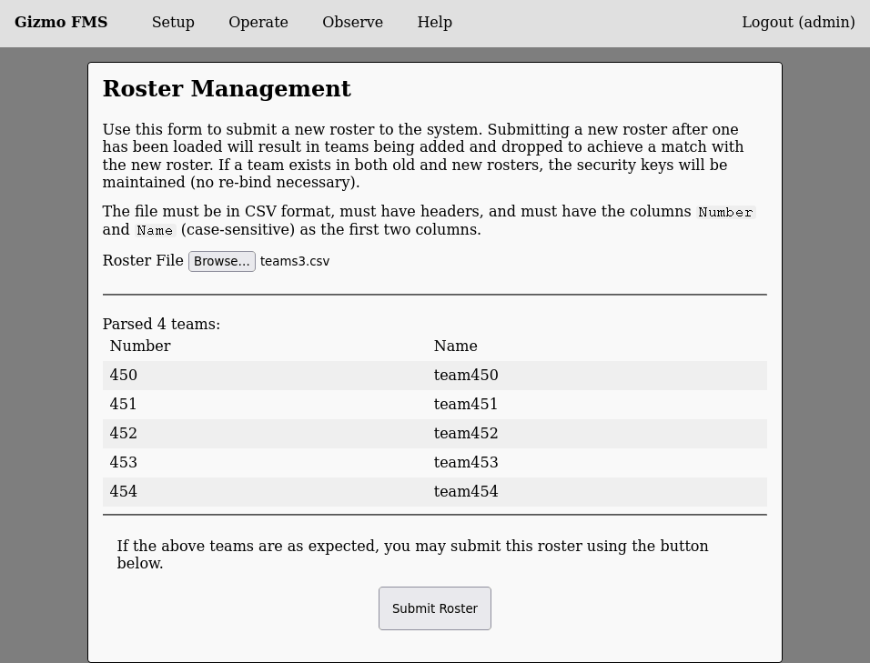

# Roster Setup

The FMS is able to provide network services to Gizmos by knowing what
teams are on what field locations at any given time.  To do this, a
roster must be provided.  The FMS will import the roster from a CSV
with the following headers:


```
Number,Name
```

The column names are case sensitive and must appears as the first two
columns in the file.  Arbitrary columns may appare after the first two
and will not be read.

Select 'Roster' from the setup menu and this page will be displayed:



After you select a file, the file will be parsed and displayed as it
will be imported.  The parsed content will look like this:



If you are satisfied with the teams that have been parsed, click
'Submit Roster' and the system will update its configuration.  You can
change the roster later, and team numbers that appear in both the old
and new rosters will not be affected.
