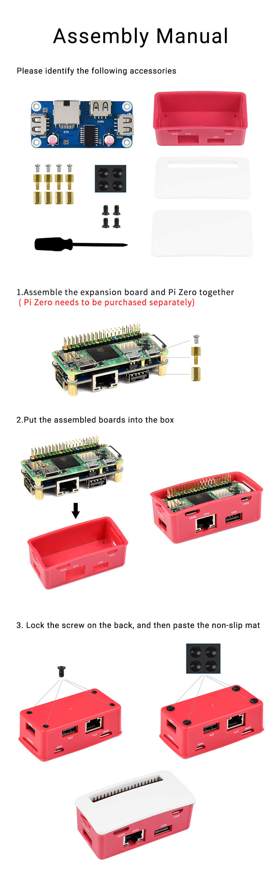
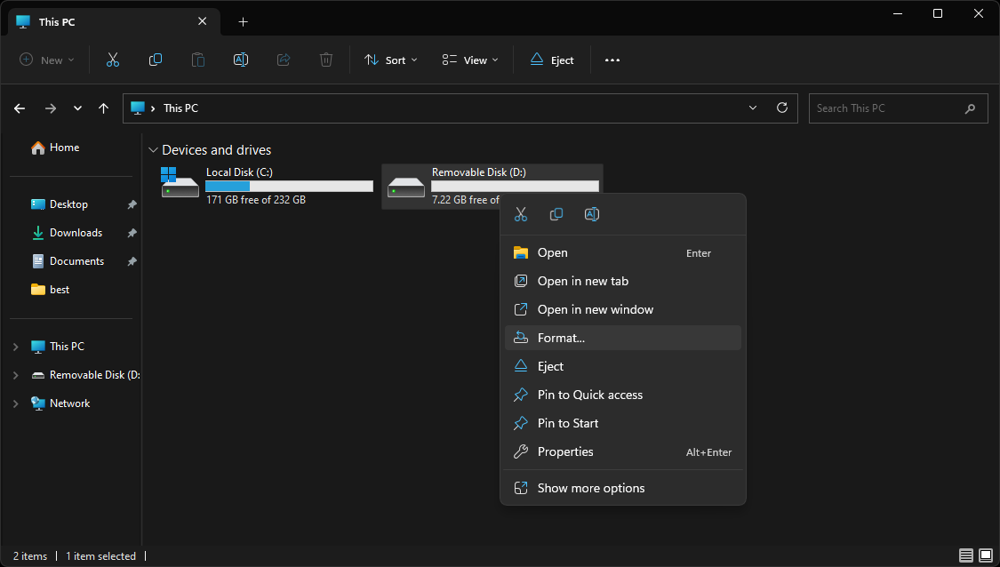
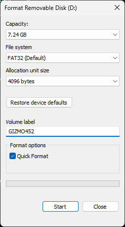
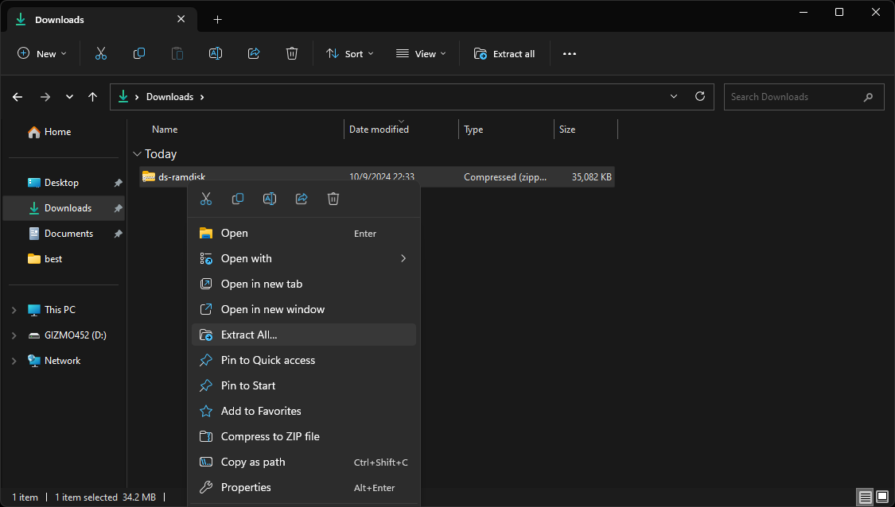
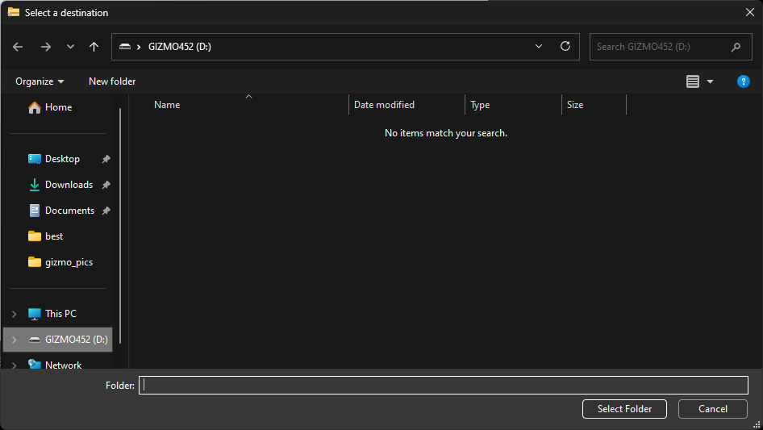
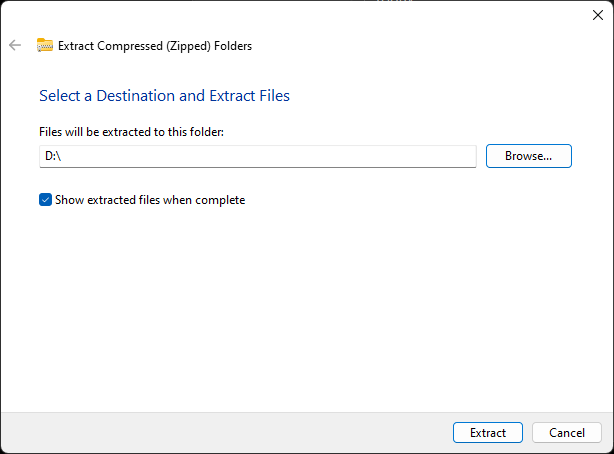
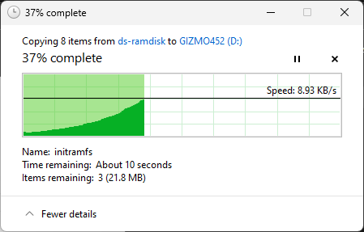
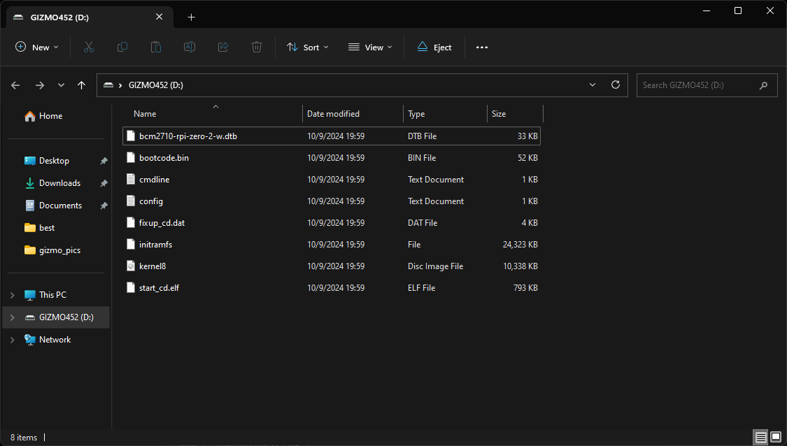

# Driver Station

While it possible to use the Gizmo software and hardware with any
computer, the Gizmo Team has developed software to provide an
appliance-like experience using an embedded Linux system called a
driver's station.

The station code is regularly tested using a [Raspberry Pi Zero 2
W](https://www.pishop.us/product/raspberry-pi-zero-2-w/) with a
[Waveshare Ethernet and USB
hub](https://www.waveshare.com/product/eth-usb-hub-box.htm).  Though
we don't actively qualify against the hardware, you should also be
able to use our driver station system images on a Raspberry Pi 4B.

## Physical Assembly

The driver's station comprises the Raspberry Pi Zero 2 W and the
Waveshare board, which you will need to assemble.  This need only be
done once and once assembled there is no need to disassemble.

Consult the following graphic from the Waveshare documentation for
assembly instructions, paying special attention to the order of the
brass spacers that are used to assemble the PCB stack:

When installing the white cover plate, use the one without the cutout
in it.  Both are provided, but only the one without the cutout is
required.

## Software Installation

Once physical assembly is complete, you must install the software
image that runs the driver's station.  Ensure you have a means of
writing a micro SD card for this step, using adapters if necessary.

> [!TIP]
>
> For first time setup of a never-before-used micro SD card, you can
> instead flash `ds-ramdisk.img.zip` using Balena Etcher as described
> in [the appendix](../appendix/imaging.md) which will automatically
> partition, format, and install the driver's station software to your
> micro SD card.  All other updates can then be performed using the
> zip file as described below.  Note that using Balena Etcher does
> require one-time administrative access, and may not be suitable for
> unprivileged student computers in schools.
>
> Once you have imaged the disk with etcher, be sure to change the
> name to `GIZMO<NUMBER>` as described below.

> [!NOTE]
>
> If this procedure doesn't appear to work for you, you may need to
> [repartition your micro SD card](../appendix/full_partition.md).  This
> can happen on some newer Windows 10 and Windows 11 machines where
> inappropriate defaults are selected.
>
> If you have come here from the repartitioning guide, skip directly
> to the step below where you extract the `ds-ramdisk.zip` file.

Obtain the latest system image from the [GitHub releases
page](https://github.com/gizmo-platform/gizmo/releases/).  For the
driver's station, use the `ds-ramdisk.zip` file.  The following
instructions will be shown using Microsoft Windows, but similar
instructions may be followed on other operating systems.

Begin by inserting the Micro SD card into a reader and plug it into
your PC.  Open Windows Explorer, select 'This Computer' and right
click on the inserted (blank) drive.  In the context menu, choose the
"format" option.

In the resulting format window, leave all options at the default, but
fill in the Volume Label field.  This field is case sensitive and
should take the format of `GIZMO<NUMBER>` where `<NUMBER>` is the
number of the team that should be associated with this driver's
station.  Do not left-pad the number field (#452 should be 3 digits,
not having a leading zero).

The format process will take several seconds, and once it completes
the disk will re-attach as a named volume starting with `GIZMO`.
Proceed by locating the `ds-ramdisk.zip` file you downloaded earlier
and right-click it.  In the context menu, select 'Extract All'.

In the resulting file extraction wizard window, select "Browse..."
which will open a file browser window.  In this window, select the
`GIZMO` disk from the left sidebar.  Select the drive itself.

Once you have made your selection, the extraction wizard will be ready
to proceed.  Configured, it should look like this:

The extraction wizard will show a top level disk, in this case, the
'D' drive.  Click 'Next' and a progress window will appear:

Once the extraction completes, the Gizmo disk will re-open and now
contain files:

Eject the disk.  Wait for either Windows to remove the drive and say
it is safe to disconnect, or 30 seconds after clicking eject. Install
the card into the labeled slot on the case labeled "TF Card".  The
card should be installed with the metal contacts facing the bottom of
the case, and take care to insert the card into the reader.  Its easy
to miss the reader and just push the card into the case if you're not
careful.

> [!NOTE]
>
> If you've been using the Gizmo for a while, you may be wondering
> where the `gsscfg.json` file is.  This file has been obsoleted.  You
> can still use one if you'd like, but the team number is now read
> from the volume label, and other values are derived from the driver
> station's hardware IDs.
